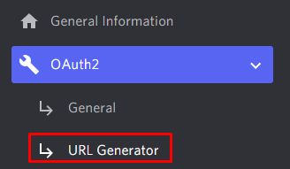

# Discord bot with Node.js

## Documentation
- [Discord.js docs](https://discord.js.org/#/docs/discord.js/stable/general/welcome)
- [Discord developer portal](https://discord.com/developers/docs/intro)
- [Node.js docs](https://nodejs.org/en/docs/)
- [Javascript](https://developer.mozilla.org/en-US/docs/Web/JavaScript)

> #### Note
> If you ever feel like something is not clear enough, there are links everywhere to the docs. This is not a in-depth guide, it is only a general guide to get things going, and I assume you already have some knowledge of Javascript. If not, start  there, there are plenty of [tutorials](https://www.w3schools.com/js/) online.

## Setup
### Node.js

Download and run the installer at https://nodejs.org/
Check the version of Node.js and npm with
`node -v`
`npm -v`

### Text editor
Use your favorite text editor, examples:
 - [VSCode](https://code.visualstudio.com/download)
 - [Sublime Text](https://www.sublimetext.com/)
 - [Atom](https://atom.io/)

### Project folder
- Make a new directory in your computer, for this demo I will name it "discord-js-bot".
- Open your folder in your text editor (for example, with VSCode open, drag your folder into the program, or go to File > Open Folder)

### npm init
- Open the terminal inside your project folder, and type `npm init -y`.
([docs](https://docs.npmjs.com/cli/v8/commands/npm-init))

This will generate a **package.json** file inside your folder.


### Discord js


- Type in your terminal `npm install discord.js`
([docs](https://discord.js.org/))

This will create a folder **node_modules** and a file **package-lock.json** in your project folder and add the discord dependency to your package.json.

### Dotenv
- Finally, type in your terminal `npm install dotenv`
([docs](https://www.npmjs.com/package/dotenv))
This will get the dotenv module which will allow us to use environment variables.

 - Create a file **.env** inside your project folder.

### src folder and bot.js
- Inside your project folder, create a new folder, name it **src**
- In the src folder create a new file and name it **bot.js**, this is the main file for your bot.

## Basics of bots
### Bot Token
 - Go to the Discord developer portal at https://discord.com/developers/applications
 - Create a new application and give it a name, I will call mine **Nodejs Bot Application**.
 - You will be taken to the application page. Navigate to the **Bot** tab on the left menu.
 - Click on **Add Bot**.

>This will add a bot user to the application. On Discord, bots are added to servers as users to be able to perform their functions. Now you can customize your bot user. Change its username and profile picture if you want.


 - Copy the Bot Token
 - In your **.env** file, add this line:
	 - `TOKEN=<paste your token here>`
	 - In my case, I will have `TOKEN=OTU1MDgyMTI0MjA4Mjc1NDU3.Yjcfig.W8XEOcBofwEKBRftKvpFzcFHd3o`

#### Attention:
This is a **PRIVATE** token, you should **NOT** show anyone else this token. If you accidentally post it somewhere, you can always reset it by clicking the **Reset Token** button in your bot page!

- To use this .env file, write this line in the **bot.js** file:

		require('dotenv').config();

### Test server
To test your bot, go to Discord and **create a new server**.

Now we need to generate an invite link for our bot user. Go back to the application developer portal, and navigate to **OAuth2 > URL Generator**.



- Search for "**bot**" in the scopes, and a list of bot permissions should appear underneath. Feel free to look around - for now we will select **Administrator**, which includes all permissions.
- Copy the generated link at the bottom of this page and surf to it on your browser. A discord authorization page should appear giving you are logged in.
- Select your test server in the "add to server" dropbox.
- Click continue and authorize, and check that you are, in fact, a human... beep boop!
- Finally, go over to the discord app and check your bot is now in your test server. It should appear on the member list with a "BOT" tag and an offline status with the given name and profile picture.


### Bringing it to life
Finally we need to bring the bot to life. In your **bot.js** file, add the following lines:

```js
const { Client, Intents } =  require('discord.js');
const  client  =  new  Client({ intents: [Intents.FLAGS.GUILDS, Intents.FLAGS.GUILD_MESSAGES] });

client.once('ready', () => {
	console.log('Ready!');
});

client.login(process.env.TOKEN);
```
([docs](https://discordjs.guide/creating-your-bot/#creating-the-main-file))

Now let's run our code. Open your terminal inside the project folder, and type:

`> node src/bot.js`

If you see the "Ready!" message, head to Discord and check that the discord bot status has changed to online. Congratulations, it's a bot!


> Stop the execution of the command to stop the bot. Run the command again to restart the bot.

### Ping ... Pong
There are many types of events on discord. We have actually already used one, the 'ready' event. Check the code you already wrote:
```js
client.once('ready', () => {
	console.log('Ready!');
});
```
This bit of code executes the console.log command when the client hears a 'ready' event. 

Now let's make it act on a 'messageCreate' event. Add this bit of code:
```
client.on('messageCreate', (message) => {
	console.log(message);
});
```
Now our bot will listen to all the messages sent on your test server.

 - Restart your bot
 - Send  a message in your test server
 - Check your terminal: the bot has logged your message!

If you take a closer look at this message object, you will see it has many useful values, for example:
- channelId: the channel where the message comes from.
- content: the actual message text
- author: a User object which contains their id, username, ...
- mentions: a MessageMentions object with a boolean for a "everyone" ping, a list of users, ...

Let's check wether the content of the message is "ping", and if so, respond with "pong":
```js
if (message.content  ===  'ping') {
	message.reply('pong');
}
```


## Making it better

### .gitignore
A very important file you cannot forget about if you're uploading your code. Add a **.gitignore** file to the root of your project folder, and add the following:
```
# Node build artifacts
node_modules
npm-debug.log

.vs

# Local development
*.env
*.dev
.DS_Store

# Docker
Dockerfile
docker-compose.yml
```
Something important to notice is that your .env file is in here, so your token is safe.

### 24/7 Hosting
We are currently hosting our bot locally, and if we close the terminal, our bot dies.
 To fix this you can use a free hosting website called Heroku. ([Link](https://heroku.com/))

Tutorials:
- [Using a GitHub private repository](https://youtu.be/OFearuMjI4s)
- [Using Heroku CLI](https://youtu.be/BPvg9bndP1U)


### Commands
Users will be talking to eachother all the time. To make it clear when a user is talking to someone or giving a command to the bot, we can define a prefix. Feel free to choose any prefix you want, for this demo we will be using a "*!*".

```js
const prefix = '!';
client.on('messageCreate', (message) => {
    if (!message.content.startsWith(prefix)) {
		return;
    }
	// Command handling ...
});
```

We have a ping command (the bot responds with 'pong' when a user says 'ping'). But now imagine we add a second part to it - the bot responds 'ping' when the message is 'pong'. Can you figure what the problem is?

We can check if the user that sent the message is the bot, and ignore it as well.

```js
if (message.author.bot || !message.content.startsWith(prefix)) {
	return;
}
```

After this we can define our command and its arguments
```js
const args = message.content.slice(prefix.length).split(/ +/);
const command = args.shift().toLowerCase();

if (command === 'ping') {
    message.reply('pong');
}
```
When adding more and more commands, this file can get quite big, so it's better if we start splitting the commands up into different files. Create a folder **commands** inside **src**. We need to use Node.js File System module *fs* ([doc](https://www.w3schools.com/nodejs/nodejs_filesystem.asp)) to get into other files.

```js
const fs = require('fs');
client.commands = new Map();
const commandFiles = fs.readdirSync('./src/commands').filter(file => file.endsWith('.js'));
for (const file of commandFiles) {
    const command = require(`./commands/${file}`);
    client.commands.set(command.name, command);
}
```

Create a file **ping.js** inside your new commands folder. In it you can add this code:
```js
module.exports = {
    name: 'ping',
    description: 'Ping!',
    execute(message, args) {
        message.reply('pong!');
    }
};
```

Now go back to the bot.js file, and in the command handler replace the original ping command with a call to the external command:

```js
if (command === 'ping') {
	client.commands.get('ping').execute(message, args);
}
```
