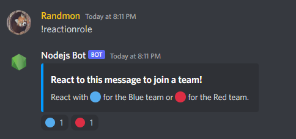

# Maintenance commands

## Permissions

### Specific Roles

We want to create some commands that only moderators can use.
First let's create a Mod role in our server. Go to Server Settings > Roles and click **Create Role**

Name it "Mod", enable `Allow anyone to @mention this role` (for now to get the role id, you can turn it off later). Send a message in your server with "\\@Mod" which will give you <@[ID]>


Copy the id. You can now turn off the `Allow anyone to @mention this role` option if you want.

Now let's make it so that only users with the Mod role can use our ping command. In the ping.js file, inside the **execute** method:

```js
if (message.member.roles.cache.has('YOUR ROLE ID HERE')) {
    message.reply('pong!');
} else {
    message.reply('You do not have permission to use this command.');
}
```
 - Replace the text with your own Mod role ID.

Let's test it. I don't currently have the Mod role.


If I give myself the role, it works again!

### Specific Permissions

Maybe you don't want to check by role but rather by permission. Let's make a ban command and check if the user has the permission to ban members.

Let's create a new command file **ban.js**
```js
module.exports = {
    name: 'ban',
    description: 'Bans a user from the server.',
    execute(message, args) {
        if (message.member.permissions.has('BAN_MEMBERS')) {
            message.reply('User banned!');
        } else {
            message.reply('You do not have permission to use this command.');
        }
    }
};
```

 - Add the ban command to the command handler in the **bot.js** file.
 - Since you created this server, you have ban permissions. If you want to test this, you will have to add another user to the server.


---
## Clear messages

In a new command file **clear.js**:

```js
module.exports = {
    name: 'clear',
    description: 'Clear messages',
    async execute(message, args) {
        if (message.member.permissions.has(['MANAGE_MESSAGES'])) {
            if (!args[0] || isNaN(args[0]) || args[0] < 1) {
                message.channel.send('Please specify a valid number of messages to delete.');
            } else if (args[0] > 100) {
                message.channel.send('You can only delete up to 100 messages at a time.');
            } else {
                //Wait for messages to be fetched before deleting them
                await message.channel.messages.fetch({ limit: args[0] }).then(messages => {                    
                    message.channel.bulkDelete(messages, true); //bulkDelete(message list, filter old?)
                });
            }
        } else {
            message.reply('You do not have permission to use this command.');
        }
    }
};
```

 - Add the clear command to the command handler in the **bot.js** file.
 - Warning: You cannot bulk delete messages older than 14 days. This is an API limitation, and you can only do this manually.

---
## Kick and Ban

Add a new **kick.js** command file:

```js
module.exports = {
    name: 'kick',
    description: 'Kicks a user from the server.',
    execute(message, args) {
        if (!message.member.permissions.has('KICK_MEMBERS')) {
            return message.reply('You do not have permission to kick members.');
        }
        const member = message.mentions.members.first();
        if (!member) {
            return message.reply('Please mention a valid member of this server');
        }

        const targetMember = message.guild.members.cache.get(member.id);
        targetMember.kick();
        message.channel.send(`${member.user} has been kicked.`);
    }
};
```

 - Add the kick command to the command handler in the **bot.js** file.


 - Now copy the code for kicking over to the **ban** command, and just change `.kick()` to `.ban()` along with the informative messages.

 ---
 ## Welcome message and role

- Go to the developer portal ([link](https://discord.com/developers/applications)). Go to your bot application > Bot and enable **both Privileged Gateway Intents**


Create a role for anyone who joins the server to be assigned. I have named this **"Newbie"**.

In the bot.js file:
 - Add the `GUILD_MEMBERS` intent to the client constructor
 - Below the messageCreate event, add:

```js
client.on('guildMemberAdd', member => {
    //Add welcome role
    let welcomeRole = member.guild.roles.cache.find(role => role.name === 'Newbie');
    member.roles.add(welcomeRole);

    //send welcome message
    const channel = member.guild.channels.cache.find(ch => ch.name === 'welcome');
    if (!channel) return;
    channel.send(`Welcome to the server, ${member}!`);
});
```

## Reaction Roles

We want to give users specific roles when they react to a certain message with an emoji.

 - Add the `GUILD_MESSAGE_REACTIONS` intent to the client constructor.
 - Add a reaction role command to the command handler in the **bot.js** file:
```js
 else if (command === 'reactionRole') {
    client.commands.get('reactionRole').execute(message, args, Client, client);
}
```
 - We are going to create two roles on the server for this demonstration, **Blue** and **Red**. I've also created a channel **get-roles** on the server where the message with the reactions will be.
 - Create a **reactionRole.js** command file:
```js
module.exports = {
    name: "reactionrole",
    description: "React to a message to get a role",
    execute(message, args, Discord, client) {
        const channel = 'YOUR CHANNEL ID HERE';
        //...
    }
}
```
- Replace the text with your own get-roles channel ID
- Next store the roles as variables
```js
const blueRole = message.guild.roles.cache.find(role => role.name === 'Blue');
const redRole = message.guild.roles.cache.find(role => role.name === 'Red');
```

Choose one emoji for each role. Type a "\\" before the emoji and send it as a message in your server. This way you can copy the emoji correctly into your code.


- Now store your emojis as variables
```js
const blueEmoji = '🔵';
const redEmoji = '🔴';
```
- This is the message we will be sending ([docs on embeds](https://discordjs.guide/popular-topics/embeds.html#embed-preview)):
```js
let embed = new Discord.MessageEmbed()
    .setTitle('React to this message to join a team!')
    .setDescription('React with 🔵 for the Blue team or 🔴 for the Red team.')
    .setColor('#0099ff');
```

Now we just have to send the message and react to it, but we need it to wait for the message to be sent to be able to react
- Make the execute method async: add the `async` keyword before the word `execute`
- After the definition of your embed message, send it and wait for it:
```js
let messageEmbed = await message.channel.send({ embeds: [embed] });
```
- Now it can react to the message:
```js
messageEmbed.react(blueEmoji);
messageEmbed.react(redEmoji);
```



 - Still in the execute method, add a listener for reactions:

 ```js
 client.on('messageReactionAdd', async(reaction, user) => {
    if (reaction.message.partial) await reaction.message.fetch();
    if (reaction.partial) await reaction.fetch();
    if (user.bot || !reaction.message.guild || reaction.message.channel.id !== channel) return;

    if (reaction.emoji.name === blueEmoji) {
        await reaction.message.guild.members.cache.get(user.id).roles.add(blueRole);
    } else if (reaction.emoji.name === redEmoji) {
        await reaction.message.guild.members.cache.get(user.id).roles.add(redRole);
    } else return;
});
 ```

 - The code to remove the role is almost the same:
    - Replace `messageReactionAdd` with `messageReactionRemove`
    - Replace `roles.add(...)` with `roles.remove(...)`

